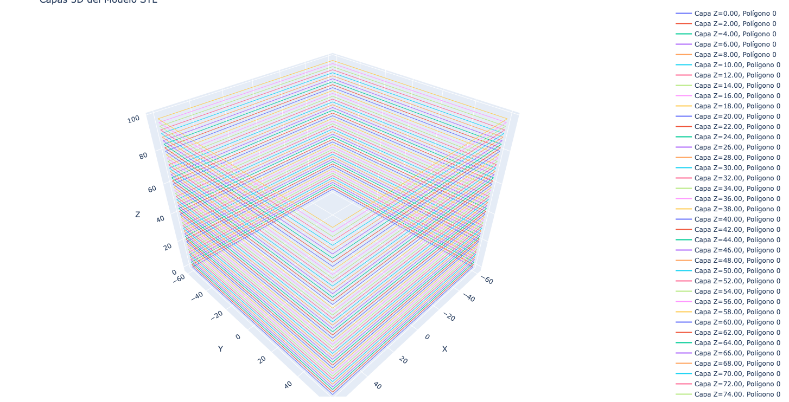
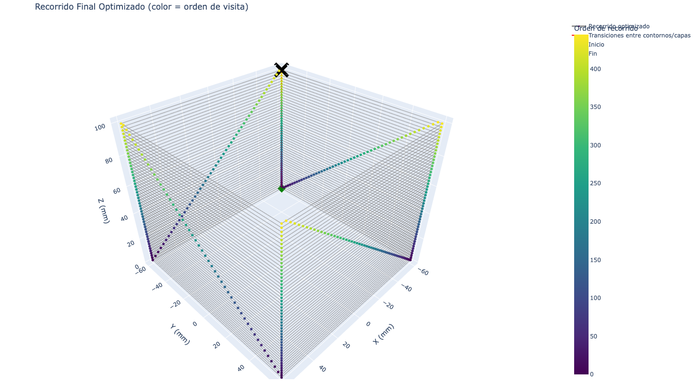
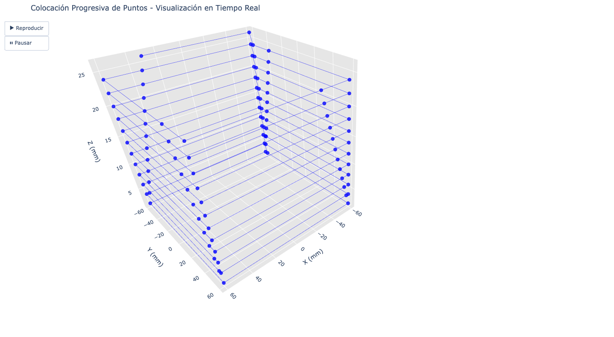
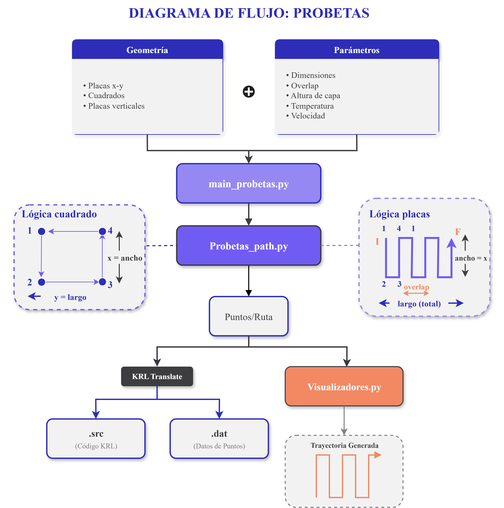

# KUKA_EXTRUDER
El funcionamiento del brazo robótico KUKA KR6/2 con el módulo de extrusión se sustenta en los siguientes códigos

* Control del giro del tornillo: [stepper-motor.ino](stepper-motor.ino)
* Slicer: Contornos [main_contornos.py](main_contornos.py) y probetas planas [main_probetas.py](main_probetas.py)
* Visualizadores: [visualizadores.py](visualizadores.py)

## Librerías necesarias

* numpy
* trimesh


## Control del giro
Actualmente el control de las RPM del tornillo se realiza de manera manual actualizando el código del Arduino Uno. A continuación se muestra un extracto del código [stepper-motor.ino](stepper-motor.ino) donde se realizan los cambios de RPM (*long RPM*) y tiempo de retracción (*long retractionTime*)

```
long retractionTime = 600; // Time of retraction
int STEP = 4; // Pulse pin
int DIR  = 5; // Direction pin
int ENA = 6; // Enable pin
int BUTTON = 2; // Button pin
long RPM = 800; 
long SPR = 400; // Steps per revolution
```


## Slicer

Aquí se encuentran los código encargados de generar la ruta según las geometría y parámetros operacionales deseados.

### Geometrías posibles
* Contornos de una línea
* Bloques 

### Parámetros operacionales
* Velocidad de movimiento
* Altura de capa

> [!IMPORTANT]
> El código cuenta con un apartado para cambiar RPM y temperatura, pero actualmente tiene que hacerse de manera manual por la falta de comunicación entre el brazo, Arduino Uno y Termocupla.

### Código contornos 

Los códigos que permiten generar la ruta a través de un archivo STL y con los parámetros operacionales deseados se ven representados en el siguiente de diagrama:


#### [Main_contornos.py](main_contornos.py)
Aquí es donde se ingresan y configuran los parámetros operacionales y la geometría en la sección de código mostrada a continuación

```
stl = "Geometrías_contornos/cilindro.stl"
altura_capa = 2
z_offset = 2 #En caso de que la pieza no esté centrada en el origen, se puede usar un offset en Z para que la primera capa quede a la altura deseada.

SEAM_DELTA = 3.5          #Distancia mínima entre el último punto de un contorno y el primer punto del mismo contorno
                          # primer punto de la primera capa como referencia


def codigo_contornos(poses, vent=1, temp=200, vel=0.025, t_enf = 3, t_retracción = 0.8):
        filename = "cilindro" #Colocar el nombre que se quiera para el archivo KRL generado.
        filename_export = "Archivos_KRL/Contorno_KRL/" #Colocar la ruta donde se quiere guardar el archivo KRL generado.

```

* **stl** = "nombre del archivo stl"
* **altura de capa** = altura de capa deseada
* **z_offset** = En caso de que la pieza no esté centrada en el origen, se puede usar un offset en Z para que la primera capa quede a la altura deseada
* **SEAM_DELTA** = Distancia mínima entre el último punto de un contorno y el primer punto del mismo contorno para evitar superposición
* **vent** = se activa ventilación 0 -> No y 1 -> Sí
* **temp**= valor de temperatura marcado en la termocupla
* **vel** = velocidad de movimiento del brazo en m/s
* **t_enf** = tiempo de espera antes de comenzar la ejecución de instrucciones de la siguiente capa
* **t_retracción** = tiempo entre que se da la indicación de giro del tornillo y desde que comienza el movimiento del brazo
* **filename** = nombre del archivo con las instrucciones para el brazo
* **filename_export** = Dirección de la carpeta donde se van a guardar los archivos

> [!NOTE]
> longitud [mm], temperatura [°C], tiempo [s], velocidad [m/s]

> [!IMPORTANT]
> Como se nombró anteriormente no existe comunicación directa entre el brazo y los equipos de regulación de temperatura y ventilación.

Al final de este código se puede encontrar estas dos funciones para activar los visualizadores

```
# Visualizar capas
visualize_layers_3d(all_layers, layers_z)

# Generar todas las rutas de herramienta
toolpaths = generate_all_toolpaths(all_layers)

#Quitar # si se quiere ver la progresión de posiciones en un archivo HTML
# visualize_positions_progressive(positions, output_file="posiciones_progresivas.html", delay=50)
```

* **visualize_layers_3d():** visualiza capas y los puntos del STL original
* **visualize_positions_progressive():** muestra un timelapse de como se va realizando la impresión

#### [slicer.py](slicer.py)

El código encargado dividir el stl según la altura de capa definida, generar los puntos dentro de una misma capa y definir el orden de estos durante el proceso de impresión. A continuación se muestran los criterios para definir la ruta 

* Vecino más cercano (_nearest_neighbor_order()): Para evitar salto entre puntos de una misma capa y se mantenga el orden del contorno
* Costura Fija (apply_fixed_seam()): Se mantiene un mismo punto inicial y final entre capas
* Detención antes del punto final (trim_closing_gap()): Para evitar que se extruya dos veces en el punto inicial se define un distancia previa al punto final (que es el mismo que el inicial) y se crea un nuevo punto, el cual se convertirá en el fin de la capa

> [!NOTE]
> Hay que tener ojo con la última capa, ya que solo se extruíra si el alto de la pieza es múltiplo de la altura de capa.

#### [visualizadores.py](visualizadores.py)
Funciones de apoyo para ver como quedó la división de capas y el ruteo de la pieza de impresión. Se puede ver a continuación las visualizaciones posibles

1. Visualizador de puntos y contornos
   


2. Visualizador de ruta



3. Timelapse de ruta




### Código probetas

Los códigos que permiten generar cubos con las dimensiones x-y-z y parámetros operacionales deseados se ven representados en el siguiente de diagrama:



#### [Main_probetas.py](main_probetas.py)

```
# Ajuste para la firma actual: probeta_path usa step_y en lugar de step_x
#positions = probeta_path(x=200, y=200, z=2.5, step_y=2.3, step_z=2.5, offset_z=2.5)  #x,y,z,step_y,step_z,offset_z
#positions = cuadrado(x=250, y=250, offset_z=2.5)
#positions = probeta_path_z_vertical(x=150, y=0, z=20, step_z=1.65, offset_z=1.6) #x,y,z,step_x,step_z
# Visualizar la ruta de puntos en 3D interactiva
visualize_path_3d(positions)

def codigo_probetas(poses, vent = 1,temp = 200, speed = 0.045 ):

        filename = "probeta"
        filename_export = "Archivos_KRL/Probetas_KRL/"
```

* **positions** = configuración de geometría que se quiere realizar (cubos, contorno cuadrado y placa vertical)
* **probeta_path** = geometría de cubos
  - x,y,z = dimensiones de largo, ancho y alto
  - step_y = separación entre lineas (overlap, recomendado 2.3)
  - step_z = altura de capa
  - offset_z = altura de la primera capa
* **cuadrado** = contorno cuadrado para pruebas de ancho de línea
  - x,y = dimensiones de largo y ancho
  - z_offset = altura de la primera capa
* **probeta_path_z_vertical **= placas verticales
  - x,y,z = dimensiones de largo, ancho y alto
  - offset_z = altura de la primera capa
  - step_z = altura de capa
* **vent** = se activa ventilación 0 -> No y 1 -> Sí
* **temp**= valor de temperatura marcado en la termocupla
* **speed** = velocidad de movimiento del brazo en m/s
* **filename** = nombre del archivo con las instrucciones para el brazo
* **filename_export** = Dirección de la carpeta donde se van a guardar los archivos


> [!NOTE]
> longitud [mm], temperatura [°C], velocidad [m/s]

> [!IMPORTANT]
> Como se nombró anteriormente no existe comunicación directa entre el brazo y los equipos de regulación de temperatura y ventilación.


