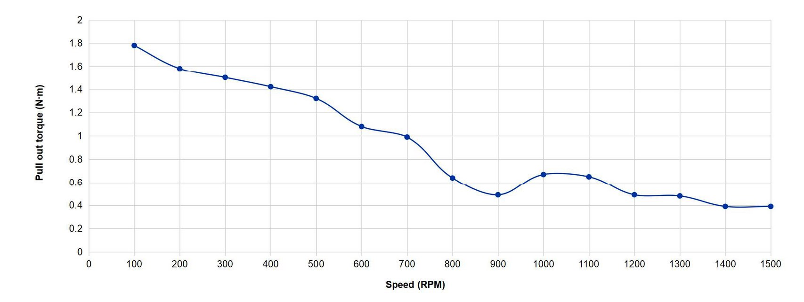

# KUKA_EXTRUDER
El funcionamiento del brazo robótico KUKA KR6/2 con el módulo de extrusión se sustenta en los siguientes códigos

* Control del giro del tornillo: [stepper-motor.ino](stepper-motor.ino)
* Slicer: Contornos [main_contornos.py](main_contornos.py) y probetas planas [main_probetas.py](main_probetas.py)
* Visualizadores: [visualizadores.py](visualizadores.py)

## Control del giro
Actualmente el control de las RPM del tornillo se realiza de manera manual actualizando el código del Arduino Uno. A continuación se muestra un extracto del código [stepper-motor.ino](stepper-motor.ino) donde se realizan los cambios de RPM (*long RPM*) y tiempo de retracción (*long retractionTime*)

```
long retractionTime = 600; // Time of retraction
int STEP = 4; // Pulse pin
int DIR  = 5; // Direction pin
int ENA = 6; // Enable pin
int BUTTON = 2; // Button pin
long RPM = 800; 
long SPR = 400; // Steps per revolution
```



## Slicer

Aquí se encuentran los código encargados de generar la ruta según las geometría y parámetros operacionales deseados.

### Geometrías posibles
* Contornos de una línea
* Bloques 

### Parámetros operacionales
* Velocidad de movimiento
* Altura de capa

> [!IMPORTANT]
> El código cuenta con un apartado para cambiar RPM y temperatura, pero actualmente tiene que hacerse de manera manual por la falta de comunicación entre el brazo, Arduino Uno y Termocupla.

###Código contornos [main_contornos.py](main_contornos.py)

Los códigos que permiten generar la ruta a través de un archivo STL y con los parámetros operacionales deseados se ven representados en el siguiente de diagrama:


