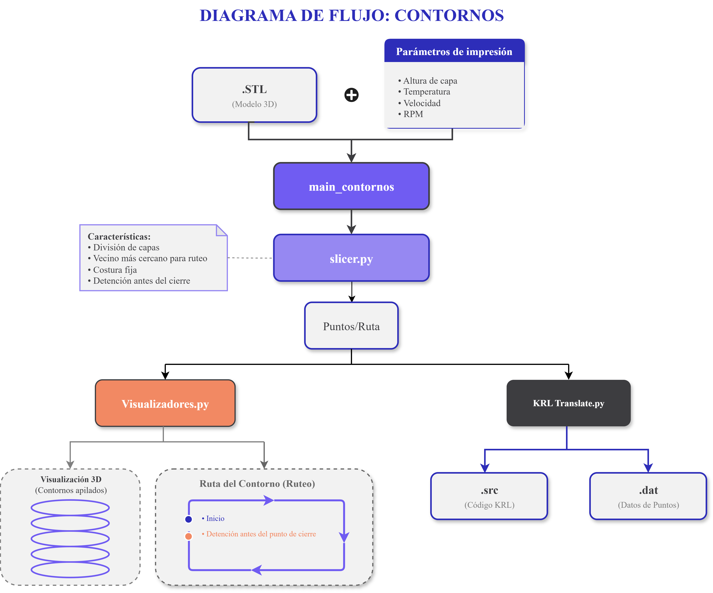

# KUKA_EXTRUDER
El funcionamiento del brazo robótico KUKA KR6/2 con el módulo de extrusión se sustenta en los siguientes códigos

* Control del giro del tornillo: [stepper-motor.ino](stepper-motor.ino)
* Slicer: Contornos [main_contornos.py](main_contornos.py) y probetas planas [main_probetas.py](main_probetas.py)
* Visualizadores: [visualizadores.py](visualizadores.py)

## Control del giro
Actualmente el control de las RPM del tornillo se realiza de manera manual actualizando el código del Arduino Uno. A continuación se muestra un extracto del código [stepper-motor.ino](stepper-motor.ino) donde se realizan los cambios de RPM (*long RPM*) y tiempo de retracción (*long retractionTime*)

```
long retractionTime = 600; // Time of retraction
int STEP = 4; // Pulse pin
int DIR  = 5; // Direction pin
int ENA = 6; // Enable pin
int BUTTON = 2; // Button pin
long RPM = 800; 
long SPR = 400; // Steps per revolution
```


## Slicer

Aquí se encuentran los código encargados de generar la ruta según las geometría y parámetros operacionales deseados.

### Geometrías posibles
* Contornos de una línea
* Bloques 

### Parámetros operacionales
* Velocidad de movimiento
* Altura de capa

> [!IMPORTANT]
> El código cuenta con un apartado para cambiar RPM y temperatura, pero actualmente tiene que hacerse de manera manual por la falta de comunicación entre el brazo, Arduino Uno y Termocupla.

### Código contornos 

Los códigos que permiten generar la ruta a través de un archivo STL y con los parámetros operacionales deseados se ven representados en el siguiente de diagrama:



#### [Main_contornos.py](main_contornos.py)
Aquí es donde se ingresan y configuran los parámetros operacionales y la geometría en la sección de código mostrada a continuación

```
stl = "Geometrías_contornos/cilindro.stl"
altura_capa = 2
z_offset = 2 #En caso de que la pieza no esté centrada en el origen, se puede usar un offset en Z para que la primera capa quede a la altura deseada.

SEAM_DELTA = 3.5          #Distancia mínima entre el último punto de un contorno y el primer punto del mismo contorno
                          # primer punto de la primera capa como referencia


def codigo_contornos(poses, vent=1, temp=200, vel=0.025, t_enf = 3, t_retracción = 0.8):
        filename = "cilindro" #Colocar el nombre que se quiera para el archivo KRL generado.
        filename_export = "Archivos_KRL/Contorno_KRL/" #Colocar la ruta donde se quiere guardar el archivo KRL generado.

```

* **stl** = "nombre del archivo stl"
* **altura de capa** = altura de capa deseada
* **z_offset** = En caso de que la pieza no esté centrada en el origen, se puede usar un offset en Z para que la primera capa quede a la altura deseada
* **SEAM_DELTA **= Distancia mínima entre el último punto de un contorno y el primer punto del mismo contorno para evitar superposición
* **vent** = se activa ventilación 0 -> No y 1 -> Sí
* **temp**= valor de temperatura marcado en la termocupla
* **vel** = velocidad de movimiento del brazo en m/s
* **t_enf **= tiempo de espera antes de comenzar la ejecución de instrucciones de la siguiente capa
* **t_retracción** = tiempo entre que se da la indicación de giro del tornillo y desde que comienza el movimiento del brazo


